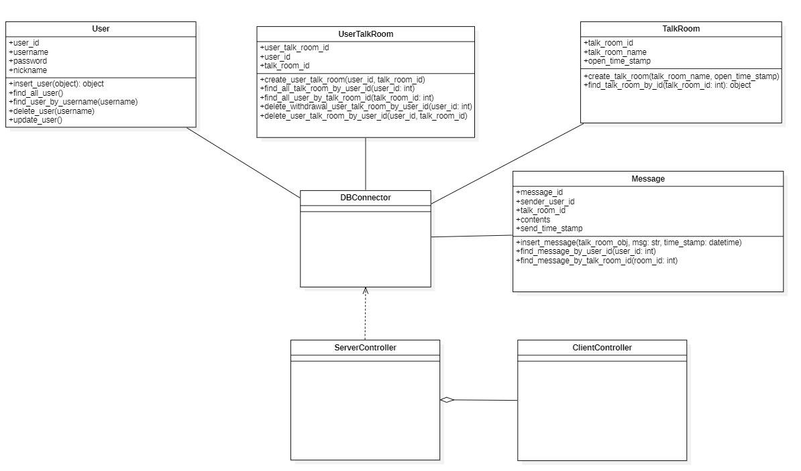
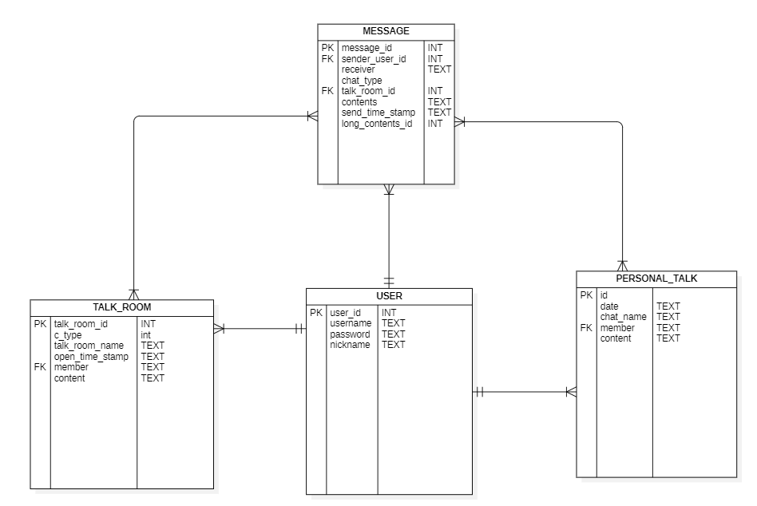

# KKOTalk
named 'KKOTalk' chatting application with python made by Going To Pro Level Team

# 작성 방법
### * PEP8 준수
###### link : https://cafe.naver.com/startdev/37360
###### link : https://cafe.naver.com/startdev/37391

### * 제작 예정 모듈은 총 다섯 가지
[Common] 공통 함수, 상수, String 저장하는 모듈입니다. common_module.py에 저장하고 사용합니다. 
 
[Code] 코드 쓰는 곳입니다.
 
[Client_Program] 클라이언트 런처 및 config 정보를 저장합니다.
 
[Server_Program] 서버 런처 및 config 정보를 저장합니다.
 
[Test] 테스트 하고싶으면 여기서 쓰십쇼
 

### * 모듈
(내장) socket, threading, datetime
(외부) sqlite3, pyqt5

### 참고 다이어그램

 
 

### 7/10 업무할당

##### 우선순위 1

성혁 : 파이썬에서 어떻게 서버 모듈 - 클라이언트 모듈을 사용하는지 
어떻게 구현할 수 있을지 연구 -> 14시까지 구글 다큐에 저장해서 같이 볼 수 있게
오늘 목표는 CLI 로 쓸 수 있는 프로토타입 만드는 것이 목표
프로토 타입

제제 : ORM 사용할 도메인 클래스 설계 13시까지하고 점심시간 피드백
, 테이블 생성 SQL 작성  14~15시 끝내기, -> CRUD 기능 시작
crud 작성 + create table 함수 만들기+ 테이블 추가

종혁 : 목업 UI 14시까지 큰틀 제작 (중간 점검) 15시 완성 예정
 -> 15시에 팀원 회의 및 보고서 활용할 예정임
QtDesigner 스타트 -> 큰틀의 파일만들어놓은 것 다 실행할 수 있게 만들어놓고, 디테일 설계 들어가기 why? 목업 했으니까

광현 : 프로젝트 계획서, 일정표 작성, Git repo, 역할 우선순위 생각 및 할당, 자료 준비

##### 우선순위 업무 생각중 2
팀이름(고잉투 프로레벨), 요구분석서, 일정표, erd
Buffer size, file descriptor, Thread, Process, Login, Join, 

